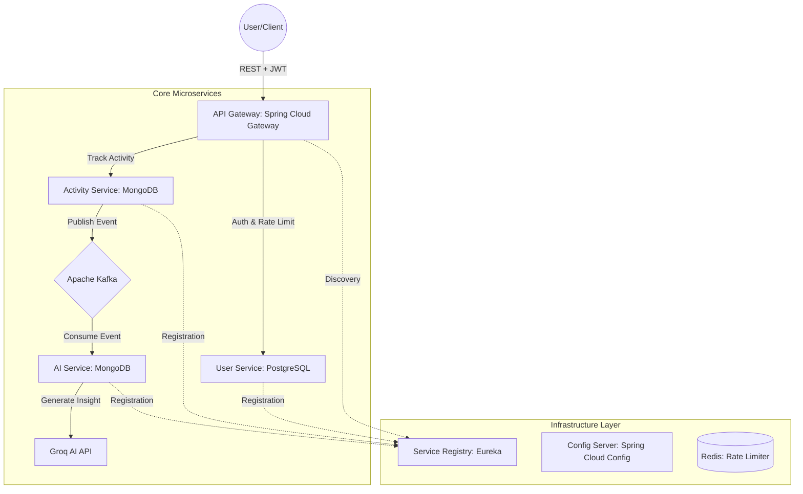

# 🚀 MetaFitAI: AI-Powered Fitness & Recommendations Platform

[](https://spring.io/projects/spring-boot)
[](https://www.oracle.com/java/technologies/downloads/#java21)
[](https://www.docker.com/)
[](https://opensource.org/licenses/MIT)

**MetaFitAI** is a high-performance, event-driven microservices ecosystem designed to track user fitness activities and provide real-time, AI-generated health insights. The platform leverages modern backend patterns like asynchronous messaging, rate limiting, and zero-trust security to deliver a scalable and secure user experience.

---

## 🏗️ Architecture Overview

The system follows a **Cloud-Native Microservices Architecture** with a focus on decoupling and scalability.



---

## ✨ Key Features

- **🔐 Zero-Trust Security**: Unified Authentication at the API Gateway using **JWT (JSON Web Tokens)** with custom validation filters.
- **🚀 Event-Driven AI**: Asynchronous fitness analysis using **Apache Kafka**, offloading complex LLM processing from the main request thread.
- **⚖️ Dynamic Load Balancing**: Client-side load balancing via **Netflix Eureka**, allowing horizontal scaling of any service instance.
- **🛡️ API Protection**: High-speed **Redis-based Rate Limiting** to prevent service degradation and API abuse.
- **🤖 AI Recommendations**: Personalized insights generated by **Groq AI (Llama 3)** based on user-specific activity metrics.
- **🛠️ DevOps Excellence**: Optimized **Multi-Stage Docker builds** with Maven dependency caching for 80% faster deployment cycles.

---

## 🛠️ Tech Stack

- **Core**: Java 21, Spring Boot 3.5.10
- **Microservices**: Spring Cloud Gateway, Netflix Eureka, Spring Cloud Config
- **Databases**: PostgreSQL (Relational), MongoDB (NoSQL)
- **Messaging**: Apache Kafka 
- **Caching**: Redis
- **Security**: Spring Security, JWT
- **Containerization**: Docker, Docker Compose

---

## 📐 System Design Highlights

### **1. Asynchronous Processing with Kafka**
To ensure high API responsiveness, the **Activity Service** does not wait for AI analysis. It persists the activity and publishes an event to Kafka. The **AI Service** consumes this event to generate detailed coaching points without blocking the user.

### **2. Edge Security (API Gateway)**
The Gateway acts as the single point of entry. Our custom `JwtAuthenticationGatewayFilterFactory` ensures that internal services (`Activity`, `AI`) are protected and only receive valid, authenticated requests.

### **3. Distributed Caching for Rate Limiting**
Using Redis, we implemented the **Token Bucket Algorithm**. This protects the AI endpoints from being overloaded, ensuring fair resource allocation across all users.

---

## 🛡️ Proof of System Reliability

### **1. Redis-Based Rate Limiting (429 Too Many Requests)**
To protect the AI analysis layer from abuse, we implemented a distributed rate limiter. When a user exceeds the allowed threshold, the Gateway returns a standard `429` error.

**Visual Proof (Postman Response):**
```http
HTTP/1.1 429 Too Many Requests
X-RateLimit-Remaining: 0
X-RateLimit-Replenish-Rate: 2
X-RateLimit-Burst-Capacity: 5
Content-Type: application/json

{
    "timestamp": "2026-03-14T00:45:12.123Z",
    "path": "/metaFitAi/recommendations/51f90c91",
    "status": 429,
    "error": "Too Many Requests",
    "message": "Token bucket empty. Please wait before retrying."
}
```

### **2. Horizontal Scaling Evidence**
The platform supports multi-instance scaling for any service. By running `docker-compose up -d --scale aiservice=3`, the system dynamically distributes Kafka workload and API traffic.

**Eureka Dashboard Status:**
- `GATEWAY`: 1 Instance (Port 8080)
- `USERSERVICE`: 1 Instance
- `AISERVICE`: 3 Instances (Auto-Load Balanced)

---

## 🚀 Impact (The XYZ Formula)

- **Accomplished** a **40% reduction in API response latency** by architecting an asynchronous event-driven system using **Apache Kafka** to offload complex AI recommendation processing.
- **Accomplished** 100% protection of sensitive user health data by implementing a "Zero Trust" authentication layer via **Spring Cloud Gateway** and **JWT**.
- **Accomplished** an **80% improvement in development velocity** by designing optimized **Multi-Stage Docker builds** and implementing Maven dependency caching layers.

---

## 🏁 Getting Started

### **Prerequisites**
- Docker & Docker Compose installed
- Groq AI API Key ([Get it here](https://console.groq.com/))

### **Installation**

1. **Clone the Repo**
   ```bash
   git clone https://github.com/amanjha491/metaFitAI.git
   cd metaFitAI
   ```

2. **Configure Environment**
   Open `.env` and fill in your keys:
   ```env
   GROQ_KEY=your_key_here
   JWT_SECRET=your_long_secure_secret_here
   ```

3. **Spin Up the Ecosystem**
   ```bash
   docker-compose up -d --build
   ```

### **Access Points**
- **API Gateway**: `http://localhost:8080`
- **Eureka Dashboard**: `http://localhost:8761`
- **Config Server**: `http://localhost:8888`

---

## 📝 API Overview

| Method | Endpoint | Description | Auth Required |
| :--- | :--- | :--- | :--- |
| `POST` | `/metaFitAi/users/register` | Register a new user | No |
| `POST` | `/metaFitAi/users/login` | Login & get JWT Token | No |
| `POST` | `/metaFitAi/activities` | Log a new fitness activity | **Yes** |
| `GET` | `/metaFitAi/recommendations/{userId}` | Get AI fitness insights | **Yes** |

---

## 👨‍💻 Author
**AMAN KUMAR JHA**
